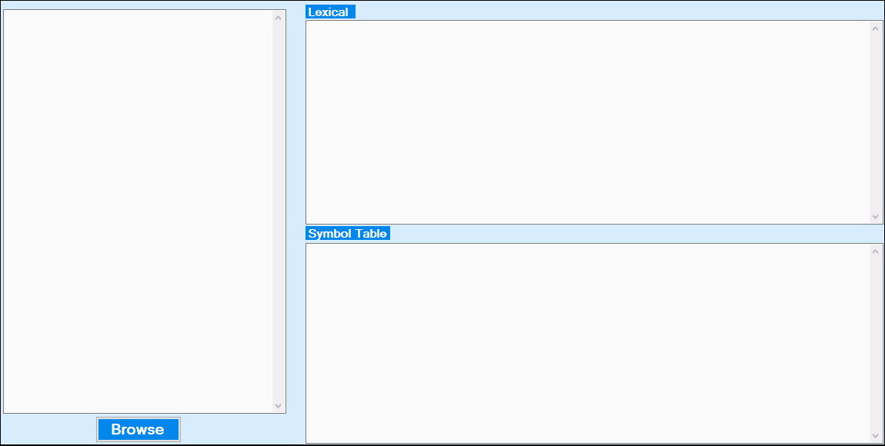

# Scanner-for-lexical-analyzer-Csharp :tada:
 A mini GUI C# program that takes a Java Source file as input and then tokenizing the file and find what each token name is(separator, identifier,operator, keyword, literal or comment).

# SceernShots

